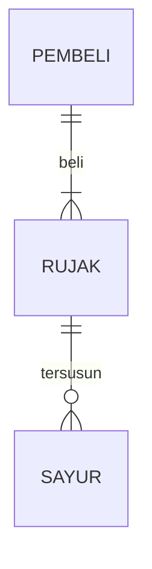

# Membuat-Game-Pertamaku-Sebagai-Pemenuhan-Tugas-UTS-Pengenalan-Informatika

## 1.1 Latar Belakang
Sejak kecil, aku menghabisi masa ceriaku dengan membaca, menulis, menggambar, dan terutama bermain video game. Dari sana saya bermimpi untuk membuat video game, walau hanya bisa mempelajari cara membuat video game dari Youtube dan bermain di console dan laptop yang seadanya. Dan kali ini aku mendapatkan kesempatan untuk membuat game pertamaku sebagai tugas UTS setelah lama mempelajari cara membuat video game dan menunggu device yang memadai. 

Ini adalah Paradigm Shift, project pertama game dari banyak projek game yang telah kurencanakan, dimulai dengan genre Role Playing Game (RPG) seperti series game Persona, dengan tema Indonesia, 3D game, dan open world. Game ini akan berfokus pada story protagonis Andi yang menemukan sebuah alat yang dapat memasuki dunia seperti Virtual Reality, namun alih alih memasuki dunia Virtual, Andi masuk ke dimensi lain dimana dunia tersebut benar benar berbeda sesuai representasi dari Creator disana, dan dunia asli tersebut berhenti sementara. Andi bertemu dengan kelompok Shifter untuk mengungkap misteri The Ultimate Creator dan Project T yang berada di dunia Paradigm tersebut.

Paradigm Shift akan menawarkan berbagai fitur dengan tujuan mengembalikan keseruan bermain game PS2 yang memiliki fitur yang seru, cerita yang seru, dan gameplay yang menyenangkan dengan grafik jaman sekarang . Gamer yang bermain game jaman sekarang banyak mengeluh bahwa game sekarang tidak enjoy untuk dimainkan lagi, bahkan kalau game tersebut ditamatkan dan banyak fanbasenya, game tersebut kurang iconic dibandingkan game jaman dulu seperti GTA, Resident Evil, Mario, dan masih banyak lagi. Fitur yang akan ditawarkan Pararigm Shift dimulai dengan game open world dimana akan banyak yang bisa dieksplor, mulai dari dunia yang interaktif, npc yang bisa diajak ngobrol, membangun chemistry dengan rekan Shifter di dunia Paradigm dan teman kuliah di dunia nyata, perang gang, desain Soul (Skin yang dapat digunakan karakter dan jurus yang unik setelah mengalahkan Creation), memasak, membeli barang, crafting senjata dan item, multiplayer roam, online battle minigame, online roam, sistem achievement, easter egg, rahasia, dan lain sebagainya.

## 1.2. Deksripsi Teknologi Informasi

Gameplay mekanik Paradigm Shift terinspirasi dengan berbagai iconic game RPG dan lainnya, mulai dari Final Fantasy, Persona, GTA Series, Yakuza, Skyrim, dan lainnya. Pemain akan menghidupi kegiatan di dunia nyata dan dunia Paradigma dimana pemain dapat bermain bebas, menjalani kehidupan kampus, dan menjalani kehidupan di dunia nyata, sedangkan kita dapat melawan Creation, mengungkap misteri Creator, berinteraksi dengan dunia yang unik, dan masih banyak lagi. Gameplay bertarung akan dibagi menjadi dua, yaitu real time RPG fighting seperti Kingdom Hearts, dan turn base RPG seperti Persona.

[SPOILER ALERT]
Story mekanik akan berfokus pada survival, rpg, openworld, freeroam, battle, puzzle, dan banyak lagi. Sedikit spoiler hehe, untuk gameplay awal pemain akan diceritakan bahwa Andi baru saja mendapat pengumuman masuk kuliah melalui jalur snbt. Andi masuk ke salah satu univ favorit di Indonesia yaitu Universitas Teknologi. Andi merantau dari Rinciang ke Danguban dengan naik bus dan menetap di kosan. Saat sampai di kosan dan beres beres kamar, Andi menemukan box yang berisi device teknologi yang terlihat kompleks dan menemukan tulisan "Project T" pada salah satu device yang dapat digenggam seperti Jarvis Ironman. Lalu Andi terteleportasi ke dunia baru yang benar benar berbeda. Disinilah kisah Andi bermulai.

Awal mulanya Andi masuk ke dunia Paradigm di Scene Medieval dimana bagian Dunia ini akan disuguhkan dengan dunia medieval seperti tema game RPG pada umumnya, dimana Andi akan bertemu dengan Raja Charles dari Kerajaan Pletoria dimana Andi diberikan tugas untuk melawan Dark Lord yang memengaruhi makhluk makhluk di Kerajaan Pletoria seperti Goblin, Elves, dan lainnya. Namun setelah beberapa perlawanan, Andi bertemu dengan makhluk aneh yang berbeda dari makhluk lain. Andi kewalahan dan hampir mati, namun tiba tiba seseorang datang dengan menggunakan device Project T yang serupa dengan yang dibawa Andi, namun terlihat dicoreng seperti Akatsuki di Naruto yang dapat melawan makhluk aneh tersebut. Disini Andi bertemu dengan Shifter, sekelompok orang yang memiliki device Project T dan berusaha mengungkap misteri dari Project T, Creation (Makhluk yang dibuat oleh Creator), dan Creator (Boss yang menginvasi setiap Scene Dunia Paradigm). Andi bertemu dengan Alia teman yang ternyata satu kuliah, Amir teman satu kosan, mantan saintis Project T Dr.Felix, dan Ketua Shifter Dr.Xenon yang memiliki dendam kesumat terhadap The Ultimate Creator, Ketua Terbesar dari Project T. Dan Scene Medieval ini adalah salah satu dari 7 Scene yang harus dihadapi untuk memasuki Scene dimana The Ultimate Creator berada.

Setelah berkenalan dengan anggota Shifter, Andi dapat kembali ke dunia aslinya dengan memencet tombol yang berada di device Project T yang bernama Teleporter untuk beristirahat. Namun saat kembali ke dunia asli, waktu menunjukkan jam yang sama saat Andi menemukan Teleporter. Padahal ketika di Dunia Paradigm waktu sudah berjalan cukup lama. Penjelasan dari Dr.Xenon menjelaskan bahwa Dunia Paradigm berbeda dengan dunia virtual, dimana dunia virtual ini berada di multiverse lain yang diciptakan oleh The Ultimate Creator itu sendiri, dan Teleporter tersebut bertujuan untuk pindah dari Dunia Paradigm ke dunia sekarang dengan menghentikan waktu di dunia sekarang. Saat dunia Paradim berjalan, dunia sekarang berhenti, dan sebaliknya. Lalu Andi bertemu dengan Amir saat di kosan dan bertemu dengan Alia saat masa perkenalan. Andi juga bertemu dengan Dr.Felix yang ternyata ketua jurusan disana dengan nama asli Ferdi dan Dr.Xenon yang ternyata rektor disana dengan nama asli Seno. Disini Andi dapat mengeksplorasi antara Dunia Paradigm dan dunia nyata dengan bebas dan sudah mulai free roam dan open world tanpa guide introduction lagi. Disini akan ada banyak ending tergantung dari pilihan player. Salah satunya jika player hanya berfokus di dunia nyata tanpa menghiraukan Dunia Paradigm, Andi akan dikecam oleh Pa Seno karena tidak membantunya mengungkap Project T dan akan mendapatkan ending tersebut.
[SPOILER END]

Teknologi Informasi yang digunakan untuk membuat game Paradigm Shift adalah Unity, Blender, Visual Studio, PixelLab, dan Bandlab :
1. Unity digunakan untuk mengimport asset 3d, mengatur asset 3d, dan mengumpulkan semua bahan untuk disusun menjadi game yang terpadu.
2. Blender digunakan untuk membuat asset 3d dari awal. Blender berguna untuk membuat desain sendiri yang sesuai dengan desain game yang kita inginkan, misal tokoh karakter utama.
3. Visual Studio digunakan untuk mengcoding game agar bisa berfungsi. Visual Studio memiliki keunggulan dibanding VS Code atau program codingan lain, dimana ada plugin khusus Unity untuk mengcoding yang menggunakan bahasa C#.
4. PixelLab digunakan untuk menggunakan desain background, karakter, dan lainnya dalam bentuk gambar dan desain grafis.
5. BandLab digunakan untuk membuat musik sendiri agar tidak terkena copyright claim ketika mempublish game ke platform publik.

## 1.3. Branding

1. Merek = Paradigm Shift
2. Tagline = Shift Your Paradigm
3. Campaign = Membuat Game yang memiliki kekayaan story yang seru, fitur yang banyak dan menarik, dan mengembalikan keseruan game jaman dulu dengan grafik jaman sekarang
4. Target User =
-Usia 13+
-Pemain casual yang rindu dengan keseruan game jaman dulu
-Pemain rpg yang menyukai fitur bertarung yang unik
-Pemain yang menyukai story yang panjang, kaya dan menarik
-Pemain yang menyukai nuansa Indonesia
5. User Experience =
- Sederhana
- Menarik
- Banyak fitur
- Warna = Suasana melankolis, colorful
- Inspirasi Desain =

## 2. User Story

Sebagai | Kita Dapat | Sehingga | Prioritas
---|---|---|---
Pengguna | Menggerakan Karakter | Dapat bergerak | ⭐⭐⭐⭐⭐
Pengguna | Mengalahkan Musuh | Mendapatkan Item dan Exp | ⭐⭐⭐⭐⭐
Pengguna | Menggunakan Jurus | Puas melihat jurus tersebut | ⭐⭐⭐⭐⭐
Pengguna | Melawan musuh secara real time | Fokus pada keseruan gameplay | ⭐⭐⭐⭐⭐
Pengguna | Melawan musuh secara turn base | Menggunakan strategi untuk melawan musuh | ⭐⭐⭐⭐⭐
Pengguna | Melawan Boss Unik | Mendapatkan Item langka dan Exp yang banyak | ⭐⭐⭐⭐⭐
Pengguna | Menamatkan Story Mode | Menikmati story yang menarik | ⭐⭐⭐⭐⭐
Pengguna | Mendapatkan beragam ending | Mendapatkan kepuasan dan ending atas pilihan user | ⭐⭐⭐⭐⭐
Pengguna | Menamatkan Main Quest dan Side Quest | Mendapatkan sisi lain story yang unik dengan easter egg di dalamnya | ⭐⭐⭐⭐⭐
Pengguna | Berjalan-jalan di dunia asli | Menikmati pemandangan dunia asli dengan nuansa Indonesia | ⭐⭐⭐⭐⭐
Pengguna | Berjalan-jalan di dunia Paradigm | Menikmati pemandangan dunia Paradigm yang unik dan menarik | ⭐⭐⭐⭐⭐
Pengguna | Main multiplayer offline di 2 dunia | Merasakan keseruan bersama teman dan menambah persahabatan sekitar | ⭐⭐⭐⭐⭐
Pengguna | Main multiplayer online dan minigame khusus | Merasakan keseruan bersama teman dan menambah relasi di internasional | ⭐⭐⭐⭐⭐
Pengguna | Memasak di dunia Paradigm | Mendapatkan makanan yang dapat menambah darah dan menambah buff/debuff khusus | ⭐⭐⭐⭐
Pengguna | Membeli item di dunia Paradigm | Mendapatkan makanan yang dapat menambah darah dan menambah buff/debuff khusus | ⭐⭐⭐⭐
Pengguna | Mengupgrade kualitas item di dunia Paradigm | Menaikkan level item agar lebih mudah melawan musuh | ⭐⭐⭐⭐
Pengguna | Berburu di dunia Paradigm | Mendapatkan daging untuk dimasak | ⭐⭐⭐⭐
Pengguna | Memancing di dunia Paradigm | Mendapatkan ikan untuk dimasak | ⭐⭐⭐⭐
Pengguna | Mengambil tanaman di dunia Paradigm | Mendapatkan tanaman sebagai obat dan buff | ⭐⭐⭐⭐
Pengguna | Memecahkan puzzle di dunia Paradigm | Mendapatkan item langka | ⭐⭐⭐⭐
Pengguna | Melawan Boss Unik | Mendapatkan Item langka dan Exp yang banyak | ⭐⭐⭐⭐
Pengguna | Berjalan-jalan di dunia asli | Menikmati pemandangan dunia asli dengan nuansa Indonesia | ⭐⭐⭐⭐
Pengguna | Berjalan-jalan di dunia Paradigm | Menikmati pemandangan dunia Paradigm yang unik dan menarik | ⭐⭐⭐⭐
Pengguna | Memasak di dunia Paradigm | Mendapatkan makanan yang dapat menambah darah dan menambah buff/debuff khusus | ⭐⭐⭐⭐
Pengguna | Membeli item di dunia Paradigm | Mendapatkan makanan yang dapat menambah darah dan menambah buff/debuff khusus | ⭐⭐⭐⭐

## 3. Struktur Data

Cara membuat aneka macam bentuk grafik menggunakan mermaid.js bisa lihat di [https://mermaid.js.org/syntax/entityRelationshipDiagram.html](https://mermaid.js.org/syntax/entityRelationshipDiagram.html) 

## 4. Arsitektur Sistem

Masih pake mermaid.js juga bisa lihat flowchart di [https://mermaid.js.org/syntax/flowchart.html](https://mermaid.js.org/syntax/flowchart.html)

## 5. Teknologi, Library, dan Framework

bla bla bla

## 6. Desain User Experience dan User Interface

Bisa load image 

## 7. Demonstrasi Video

https://youtu.be/HzC67H-aHIw?si=18Cmy-rppTi5vUnr

01:36 Demonstrasi Game
06:03 Source Code #1 (Audio Manager)
10:07 Source Code #2 (Cutscene Time)
11:17 Source Code #3 (Loading Screen)
15:50 Source Code #4 dan #5 (Change Scene)
18:24 Source Code #6 dan #7 (Character Movement)

## 8. Bagaimana mesin komputasi dan sistem operasi berperan dalam produk teknologi informasimu ?

https://youtu.be/HzC67H-aHIw?si=18Cmy-rppTi5vUnr

23:53 Proses Mesin Komputasi dan Sistem Operasi dalam Game

## 9. Bagaimana algoritma, struktur data, dan bahasa pemrograman berperan dalam produk teknologi informasimu ?

https://youtu.be/HzC67H-aHIw?si=18Cmy-rppTi5vUnr

26:28 Peran Algoritma, Struktur Data, dan Bahasa Pemrograman dalam Game

## 10. Bagaimana metode pengembangan perangkat lunak / Software Development Life Cycle berperan dalam produk teknologi informasimu ?

https://youtu.be/HzC67H-aHIw?si=18Cmy-rppTi5vUnr

33:06 SDLC (Software Development Life Cycle)

## 11. Bagaimana database / sistem basis data berperan dalam produk teknologi informasimu ?

https://youtu.be/HzC67H-aHIw?si=18Cmy-rppTi5vUnr

37:32 Peran Sistem Database/Basis Data dalam Game
