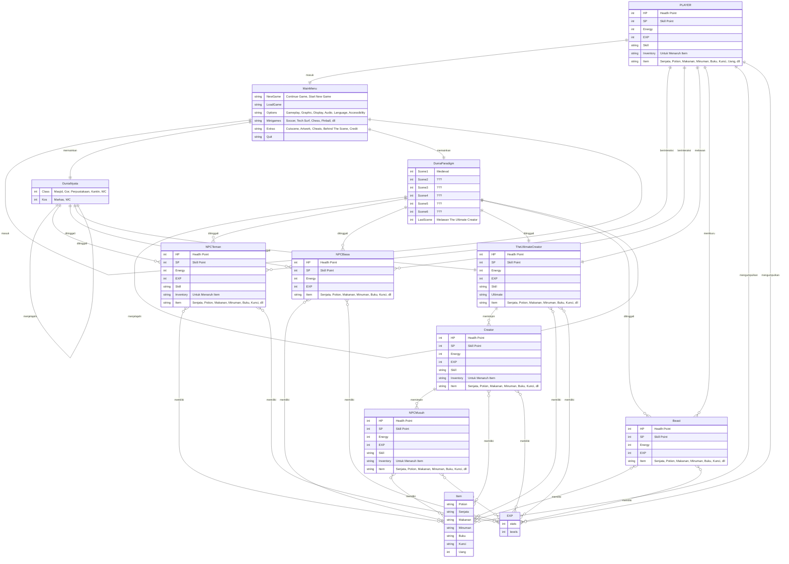
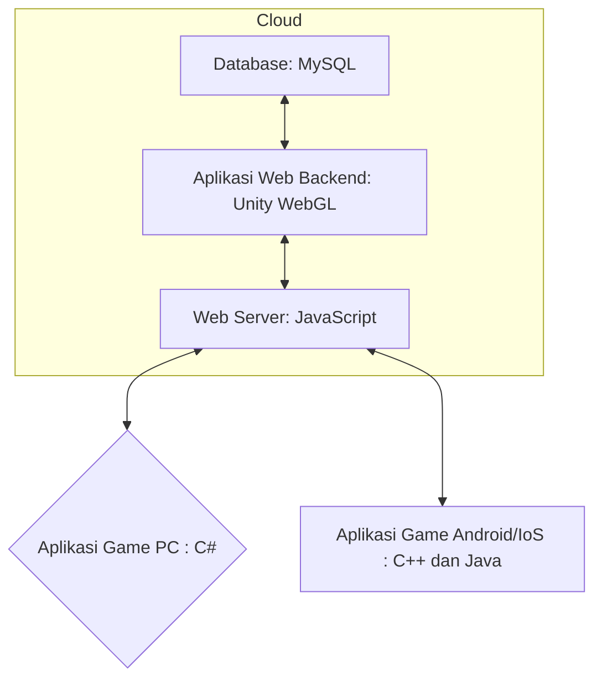

# Membuat-Game-Pertamaku-Sebagai-Pemenuhan-Tugas-UTS-Pengenalan-Informatika

## 1.1 Latar Belakang
Sejak kecil, aku menghabisi masa ceriaku dengan membaca, menulis, menggambar, dan terutama bermain video game. Dari sana saya bermimpi untuk membuat video game, walau hanya bisa mempelajari cara membuat video game dari Youtube dan bermain di console dan laptop yang seadanya. Dan kali ini aku mendapatkan kesempatan untuk membuat game pertamaku sebagai tugas UTS setelah lama mempelajari cara membuat video game dan menunggu device yang memadai. 

Ini adalah Paradigm Shift, project pertama game dari banyak projek game yang telah kurencanakan, dimulai dengan genre Role Playing Game (RPG) seperti series game Persona, dengan tema Indonesia, 3D game, dan open world. Game ini akan berfokus pada story protagonis Andi yang menemukan sebuah alat yang dapat memasuki dunia seperti Virtual Reality, namun alih alih memasuki dunia Virtual, Andi masuk ke dimensi lain dimana dunia tersebut benar benar berbeda sesuai representasi dari Creator disana, dan dunia asli tersebut berhenti sementara. Andi bertemu dengan kelompok Shifter untuk mengungkap misteri The Ultimate Creator dan Project T yang berada di dunia Paradigm tersebut.

Paradigm Shift akan menawarkan berbagai fitur dengan tujuan mengembalikan keseruan bermain game PS2 yang memiliki fitur yang seru, cerita yang seru, dan gameplay yang menyenangkan dengan grafik jaman sekarang . Gamer yang bermain game jaman sekarang banyak mengeluh bahwa game sekarang tidak enjoy untuk dimainkan lagi, bahkan kalau game tersebut ditamatkan dan banyak fanbasenya, game tersebut kurang iconic dibandingkan game jaman dulu seperti GTA, Resident Evil, Mario, dan masih banyak lagi. Fitur yang akan ditawarkan Pararigm Shift dimulai dengan game open world dimana akan banyak yang bisa dieksplor, mulai dari dunia yang interaktif, npc yang bisa diajak ngobrol, membangun chemistry dengan rekan Shifter di dunia Paradigm dan teman kuliah di dunia nyata, perang gang, desain Soul (Skin yang dapat digunakan karakter dan jurus yang unik setelah mengalahkan Creation), memasak, membeli barang, crafting senjata dan item, multiplayer roam, online battle minigame, online roam, sistem achievement, easter egg, rahasia, dan lain sebagainya.

## 1.2. Deksripsi Teknologi Informasi

Gameplay mekanik Paradigm Shift terinspirasi dengan berbagai iconic game RPG dan lainnya, mulai dari Final Fantasy, Persona, GTA Series, Yakuza, Skyrim, dan lainnya. Pemain akan menghidupi kegiatan di dunia nyata dan dunia Paradigma dimana pemain dapat bermain bebas, menjalani kehidupan kampus, dan menjalani kehidupan di dunia nyata, sedangkan kita dapat melawan Creation, mengungkap misteri Creator, berinteraksi dengan dunia yang unik, dan masih banyak lagi. Gameplay bertarung akan dibagi menjadi dua, yaitu real time RPG fighting seperti Kingdom Hearts, dan turn base RPG seperti Persona.

[SPOILER ALERT]

Story mekanik akan berfokus pada survival, rpg, openworld, freeroam, battle, puzzle, dan banyak lagi. Sedikit spoiler hehe, untuk gameplay awal pemain akan diceritakan bahwa Andi baru saja mendapat pengumuman masuk kuliah melalui jalur snbt. Andi masuk ke salah satu univ favorit di Indonesia yaitu Universitas Teknologi. Andi merantau dari Rinciang ke Danguban dengan naik bus dan menetap di kosan. Saat sampai di kosan dan beres beres kamar, Andi menemukan box yang berisi device teknologi yang terlihat kompleks dan menemukan tulisan "Project T" pada salah satu device yang dapat digenggam seperti Jarvis Ironman. Lalu Andi terteleportasi ke dunia baru yang benar benar berbeda. Disinilah kisah Andi bermulai.

Awal mulanya Andi masuk ke dunia Paradigm di Scene Medieval dimana bagian Dunia ini akan disuguhkan dengan dunia medieval seperti tema game RPG pada umumnya, dimana Andi akan bertemu dengan Raja Charles dari Kerajaan Pletoria dimana Andi diberikan tugas untuk melawan Dark Lord yang memengaruhi makhluk makhluk di Kerajaan Pletoria seperti Goblin, Elves, dan lainnya. Namun setelah beberapa perlawanan, Andi bertemu dengan makhluk aneh yang berbeda dari makhluk lain. Andi kewalahan dan hampir mati, namun tiba tiba seseorang datang dengan menggunakan device Project T yang serupa dengan yang dibawa Andi, namun terlihat dicoreng seperti Akatsuki di Naruto yang dapat melawan makhluk aneh tersebut. Disini Andi bertemu dengan Shifter, sekelompok orang yang memiliki device Project T dan berusaha mengungkap misteri dari Project T, Creation (Makhluk yang dibuat oleh Creator), dan Creator (Boss yang menginvasi setiap Scene Dunia Paradigm). Andi bertemu dengan Alia teman yang ternyata satu kuliah, Amir teman satu kosan, mantan saintis Project T Dr.Felix, dan Ketua Shifter Dr.Xenon yang memiliki dendam kesumat terhadap The Ultimate Creator, Ketua Terbesar dari Project T. Dan Scene Medieval ini adalah salah satu dari 7 Scene yang harus dihadapi untuk memasuki Scene dimana The Ultimate Creator berada.

Setelah berkenalan dengan anggota Shifter, Andi dapat kembali ke dunia aslinya dengan memencet tombol yang berada di device Project T yang bernama Teleporter untuk beristirahat. Namun saat kembali ke dunia asli, waktu menunjukkan jam yang sama saat Andi menemukan Teleporter. Padahal ketika di Dunia Paradigm waktu sudah berjalan cukup lama. Penjelasan dari Dr.Xenon menjelaskan bahwa Dunia Paradigm berbeda dengan dunia virtual, dimana dunia virtual ini berada di multiverse lain yang diciptakan oleh The Ultimate Creator itu sendiri, dan Teleporter tersebut bertujuan untuk pindah dari Dunia Paradigm ke dunia sekarang dengan menghentikan waktu di dunia sekarang. Saat dunia Paradim berjalan, dunia sekarang berhenti, dan sebaliknya. Lalu Andi bertemu dengan Amir saat di kosan dan bertemu dengan Alia saat masa perkenalan. Andi juga bertemu dengan Dr.Felix yang ternyata ketua jurusan disana dengan nama asli Ferdi dan Dr.Xenon yang ternyata rektor disana dengan nama asli Seno. Disini Andi dapat mengeksplorasi antara Dunia Paradigm dan dunia nyata dengan bebas dan sudah mulai free roam dan open world tanpa guide introduction lagi. Disini akan ada banyak ending tergantung dari pilihan player. Salah satunya jika player hanya berfokus di dunia nyata tanpa menghiraukan Dunia Paradigm, Andi akan dikecam oleh Pa Seno karena tidak membantunya mengungkap Project T dan akan mendapatkan ending tersebut.
[SPOILER END]

## 1.3. Branding

1. Merek = Paradigm Shift
2. Tagline = Shift Your Paradigm
3. Campaign = Membuat Game yang memiliki kekayaan story yang seru, fitur yang banyak dan menarik, dan mengembalikan keseruan game jaman dulu dengan grafik jaman sekarang
4. Target User =
-Usia 13+
-Pemain casual yang rindu dengan keseruan game jaman dulu
-Pemain rpg yang menyukai fitur bertarung yang unik
-Pemain yang menyukai story yang panjang, kaya dan menarik
-Pemain yang menyukai nuansa Indonesia
5. User Experience =
- Sederhana
- Menarik
- Banyak fitur
- Warna = Suasana melankolis, colorful
- Inspirasi Desain =

## 2. User Story

Pada User Story, terdapat banyak entity yang memiliki fungsinya masing-masing, mulai dari Player, NPC teman, NPC biasa, NPC musuh, Class, Creator, Beast, Item, Exp, dan Main Menu

1. Player

Player adalah entity utama yang akan digerakkan oleh pemain. Player memiliki 38 peran unik  dalam game ini sebagai berikut

No | Kita Dapat | Sehingga | Prioritas
--- | --- | --- | ---
1 | Memulai permainan | Game dapat dimainkan | ⭐⭐⭐⭐⭐
2 | Menggerakan Karakter | Dapat bergerak | ⭐⭐⭐⭐⭐
3 | Mendesain karakter | Pemain mendapatkan kepuasan dan keunikan | ⭐⭐⭐⭐⭐
4 | Mengalahkan Musuh | Mendapatkan Item dan Exp | ⭐⭐⭐⭐⭐
5 | Menggunakan Skill | Puas melihat skill tersebut | ⭐⭐⭐⭐⭐
6 | Melawan musuh secara real time | Fokus pada keseruan gameplay | ⭐⭐⭐⭐⭐
7 | Melawan musuh secara turn base | Menggunakan strategi untuk melawan musuh | ⭐⭐⭐⭐⭐
8 | Melawan Creator/Boss Unik | Mendapatkan Item langka dan Exp yang banyak, dan dapat pindah ke Scene lain | ⭐⭐⭐⭐⭐
9 | Menamatkan Story Mode | Menikmati story yang menarik | ⭐⭐⭐⭐⭐
10 | Melawan The Ultimate Creator | Mendapatkan kepuasan dan ending sesuai pilihan Player | ⭐⭐⭐⭐⭐
11 | Menamatkan Main Quest dan Side Quest | Mendapatkan sisi lain story yang unik dengan easter egg di dalamnya | ⭐⭐⭐⭐⭐
12 | Berjalan-jalan di dunia asli | Menikmati pemandangan dunia asli dengan nuansa Indonesia | ⭐⭐⭐⭐⭐
13 | Berjalan-jalan di dunia Paradigm | Menikmati pemandangan dunia Paradigm yang unik dan menarik | ⭐⭐⭐⭐⭐
14 | Main multiplayer offline di 2 dunia | Merasakan keseruan bersama teman dan menambah persahabatan sekitar | ⭐⭐⭐⭐⭐
15 | Main multiplayer online dan minigame khusus | Merasakan keseruan bersama teman dan menambah relasi di internasional | ⭐⭐⭐⭐⭐
16 | Memasak di dunia Paradigm | Mendapatkan makanan yang dapat menambah darah dan menambah buff/debuff khusus | ⭐⭐⭐⭐
17 | Membeli item di dunia Paradigm | Mendapatkan makanan yang dapat menambah darah dan menambah buff/debuff khusus | ⭐⭐⭐⭐
18 | Mengupgrade kualitas item di dunia Paradigm | Menaikkan level item agar lebih mudah melawan musuh | ⭐⭐⭐⭐
19 | Berburu Beast di dunia Paradigm | Mendapatkan EXP dan daging untuk dimasak | ⭐⭐⭐⭐
20 | Memancing di dunia Paradigm | Mendapatkan EXP dan ikan untuk dimasak | ⭐⭐⭐⭐
21 | Mengambil tanaman di dunia Paradigm | Mendapatkan tanaman sebagai obat dan buff | ⭐⭐⭐⭐
22 | Memecahkan puzzle di dunia Paradigm | Mendapatkan item langka | ⭐⭐⭐⭐
23 | Membuka Inventory di dunia Paradigm | Mengatur item yang telah didapatkan | ⭐⭐⭐⭐
24 | Membuka Crafting di dunia Paradigm | Membuat barang dan mengupgrade item | ⭐⭐⭐⭐
25 | Gacha item di dunia Paradigm | Mendapatkan item langka | ⭐⭐⭐⭐
26 | Pindah Scene di dunia Paradigm | Menjelajahi dunia baru dengan environment yang unik | ⭐⭐⭐⭐
27 | Respawn di Checkpoint | Player tidak perlu mengulang misi diawal permainan | ⭐⭐⭐⭐
28 | Revive NPC Teman | Player tidak kehilangan NPC Teman yang berguna untuk melawan musuh | ⭐⭐⭐⭐
29 | Berinteraksi dengan NPC Teman | Menambah persahabatan antar NPC Teman | ⭐⭐⭐
30 | Berinteraksi dengan NPC biasa | Mengetahui kondisi yang terjadi dan sejarah dibalik setiap Scene, Menambah persahabatan antar NPC biasa | ⭐⭐⭐
31 | Menaruh Item di Inventory NPC Teman | Player dapat membawa lebih banyak barang | ⭐⭐⭐
32 | Berinteraksi dengan Random Event | Player dapat berinteraksi atau membiarkan Random Event berjalan dan akan mendapat konsekuensinya | ⭐⭐⭐
33 | Shalat di Masjid | Player mendapat buff dan menambah stats personality | ⭐⭐⭐
34 | Olahraga di Gor Olahraga | Player mendapat buff dan menambah stats personality | ⭐⭐⭐
35 | Membaca di Perpustakaan | Player mendapat wawasan dan menambah stats personality | ⭐⭐⭐
36 | Tidur | Player mendapat buff dan memulihkan health, skill, dan energi | ⭐⭐⭐
37 | Save Game | Player tidak perlu mengulang Game dari awal dan menyimpan banyak game | ⭐⭐⭐⭐⭐
38 | Load Game | Player dapat memainkan Game dari save data | ⭐⭐⭐⭐⭐

2. NPC Teman

NPC Teman adalah NPC yang akan menjadi rekan bertarung kalian dalam melawan NPC Musuh dan menyelesaikan berbagai misi. NPC Teman memiliki keunikan dan jurus masing-masing yang memiliki keunggulan masing-masing dalam melawan musuh dan mengeksplorasi Dunia Nyata dan Dunia Paradigm. NPC Teman akan sering memberi quest dan quest unik jika pertemanan dengan Player besar. NPC Teman memiliki 11 peran unik sebagai berikut.

No | Kita Dapat | Sehingga | Prioritas
--- | --- | --- | ---
1 | Bergerak di Dunia Paradigm | Menjelajahi berbagai medan lapangan | ⭐⭐⭐⭐⭐
2 | Mengikuti Player jika disuruh | Player tidak merasa sendiri | ⭐⭐⭐⭐⭐
3 | Menyerang NPC musuh di mode Real Time | Player dapat menginisiasi penyerangan | ⭐⭐⭐⭐⭐
4 | Memberi Quest pada Player | Player dapat menjalankan quest dan mendapatkan item | ⭐⭐⭐⭐⭐
5 | Berteman dengan Player jika interaksi baik | Player merasa dekat dengan NPC tersebut | ⭐⭐⭐⭐⭐
6 | Bertengkar dengan Player jika interaksi buruk | Player yang iseng mendapatkan kepuasan ngetroll NPC teman | ⭐⭐⭐⭐⭐
7 | Memberi item kepada player | Player mendapatkan buff atau health untuk mengalahkan musuh | ⭐⭐⭐⭐⭐
8 | Menaruh item player di inventory NPC tersebut | Player dapat membawa lebih banyak item | ⭐⭐⭐⭐⭐
9 | Menunjuk jalan kepada player | Player tidak tersesat ketika menjalankan misi | ⭐⭐⭐⭐
10 | Memberi tahu cara kerja puzzle kepada player | Player dapat menyelesaikan puzzle | ⭐⭐⭐⭐
11 | Mengambil item di sekitar Player | Player tidak perlu manual mengambil item tersebut | ⭐⭐⭐⭐

3. NPC Biasa

NPC Biasa adalah NPC yang akan menetap atau berkeliling di Dunia Nyata dan Dunia Paradigm. NPC biasa memiliki berbagai jenis karakter dengan keunikan dan jurus masing-masing tergantung dari dunia dan scene yang ditinggali. NPC biasa di Dunia Paradigm kebanyakan seperti villager dan traveller tidak akan menyerang , namun beberapa NPC akan menyerang jika player bertindak kasar, terutama Guard akan berusaha menangkapmu dan memenjarakanmu jika negosiasi tidak berjalan dengan baik. Player dapat membeli item pada NPC Biasa untuk meningkatkan kekuatan Player. Beberapa NPC akan menawarkan quest kepada player dan akan ada sistem random event setiap Player menjelajahi Dunia Nyata dan Dunia Paradigm. NPC biasa memiliki 6 peran unik sebagai berikut.

No | Kita Dapat | Sehingga | Prioritas
--- | --- | --- | ---
1 | Bergerak di Dunia Paradigm dan Dunia Nyata | Menjelajahi berbagai medan lapangan | ⭐⭐⭐⭐⭐
2 | Menyerang Player jika mengancam | Player dapat kalah dari Game | ⭐⭐⭐⭐⭐
3 | Negosiasi dengan Player | Jika player menjawab dengan benar maka player akan mendapat diskon item | ⭐⭐⭐⭐⭐
4 | Berinteraksi dengan Player | Mengetahui kondisi yang terjadi dan sejarah dibalik setiap Scene, Menambah persahabatan dengan player | ⭐⭐⭐⭐⭐
5 | Menggunakan Skill dalam bertarung | Player harus menghindari skill yang dapat mengakhiri permainan | ⭐⭐⭐⭐⭐
6 | Memberi Quest pada Player | Player dapat menjalankan quest dan mendapatkan item | ⭐⭐⭐⭐⭐

4. NPC Musuh

NPC Teman adalah NPC yang akan menjadi lawan kalian selama menjalani Game ini. NPC musuh memiliki berbagai jenis karakter dengan keunikan dan jurus masing-masing di Dunia Paradigm seperti Fighter yang harus dipelajari polanya agar dapat melawan musuh tersebut. NPC musuh memiliki 7 peran unik sebagai berikut.

No | Kita Dapat | Sehingga | Prioritas
--- | --- | --- | ---
1 | Bergerak di Dunia Paradigm | Menjelajahi berbagai medan lapangan | ⭐⭐⭐⭐⭐
2 | Menyerang Player dan NPC teman | Player dapat kalah dari Game | ⭐⭐⭐⭐⭐
3 | Negosiasi dengan Player | Jika player menjawab dengan benar maka player akan mendapat buff and vice versa | ⭐⭐⭐⭐⭐
4 | Menaruh jebakan | Player yang tidak hati-hati akan mendapatkan debuff | ⭐⭐⭐⭐⭐
5 | Menggunakan Skill dalam bertarung | Player harus menghindari skill yang dapat mengakhiri permainan | ⭐⭐⭐⭐⭐
6 | Menjaga markas Project T | Player tidak dapat mengakses lootingan item langka yang ada disana | ⭐⭐⭐⭐
7 | Dikalahkan oleh Player | Player akan mendapat item dan Exp | ⭐⭐⭐⭐⭐

5. Class
   
Class adalah objek yang akan diikuti Player di Dunia Nyata. Sebagai pengenalan, Player memasuki jurusan Informatika di Universitas Teknologi, dimana player harus menjalankan Class setiap hari sesuai jadwal Mata Kuliah untuk mendapatkan buff unik dan menaikkan stats personality. Class memiliki 5 peran unik sebagai berikut.

No | Kita Dapat | Sehingga | Prioritas
--- | --- | --- | ---
1 | Memberi quiz pada Player | Player mendapat wawasan dan menambah stats personality | ⭐⭐⭐⭐⭐
2 | Menyediakan Perpustakaan untuk Player | Player mendapat wawasan dan menambah stats personality | ⭐⭐⭐⭐⭐
3 | Menyediakan Gor Olahraga untuk Player | Player mendapat buff dan menambah stats personality | ⭐⭐⭐⭐⭐
4 | Menyediakan Masjid untuk Player | Player mendapat buff dan menambah stats personality | ⭐⭐⭐⭐⭐
5 | Menyediakan Kantin untuk Player | Player dapat membeli item untuk mendapat buff | ⭐⭐⭐⭐

6. Creator

Creator adalah Boss yang harus dikalahkan player agar dapat pindah ke Scene lain. Boss terakhir dalam game ini yaitu The Ultimate Creator akan menentukan player akan mendapatkan ending apa pada game tersebut. Creator memiliki 6 peran unik sebagai berikut.

No | Kita Dapat | Sehingga | Prioritas
--- | --- | --- | ---
1 | Bergerak di Dunia Paradigm | Menjelajahi berbagai medan lapangan | ⭐⭐⭐⭐⭐
2 | Menyerang Player dan NPC Teman | Player dapat kalah dari Game | ⭐⭐⭐⭐⭐
3 | Menggunakan Skill dalam bertarung | Player harus menghindari skill yang dapat mengakhiri permainan | ⭐⭐⭐⭐⭐
4 | Menaruh jebakan | Player yang tidak hati-hati akan mendapatkan debuff | ⭐⭐⭐⭐⭐
5 | Negosiasi dengan Player | Jika player menjawab dengan benar maka player akan mendapat buff and vice versa | ⭐⭐⭐⭐⭐
6 | Dikalahkan oleh Player | Player akan mendapat item langka dan membuka Scene baru | ⭐⭐⭐⭐⭐

7. Beast

Beast adalah hewan atau makhluk yang akan ditemui player selama menjelajahi Dunia Paradigm. Beast bertindak layaknya hewan pada umumnya, seperti berburu, mencari makanan, dan tidur, namun ada beberapa Beast yang berakal dan akan memberi quiz pada Player. Beast memiliki 5 peran unik sebagai berikut.

No | Kita Dapat | Sehingga | Prioritas
--- | --- | --- | ---
1 | Bergerak di Dunia Paradigm | Menjelajahi berbagai medan lapangan | ⭐⭐⭐⭐⭐
2 | Menyerang Player dan NPC Teman | Player dapat kalah dari Game | ⭐⭐⭐⭐⭐
3 | Menggunakan Skill dalam bertarung | Player harus menghindari skill yang dapat mengakhiri permainan | ⭐⭐⭐⭐⭐
4 | Memberi quiz ke Player | Jika player menjawab dengan benar maka player akan mendapat buff and vice versa | ⭐⭐⭐⭐⭐
5 | Dibunuh oleh Player | Player akan mendapat exp dan item atau daging untuk dimasak | ⭐⭐⭐⭐⭐

8. Item

Item adalah berbagai barang yang dapat digunakan player untuk menjalani game ini. Item dapat berupa Uang, Senjata, Potion, Makanan, Minuman, Kunci, dan banyak lagi yang dapat dieksplorasi untuk memudahkan player dalam melawan musuh dan menjalani misi. Item memiliki 9 peran unik sebagai berikut.

No | Kita Dapat | Sehingga | Prioritas
--- | --- | --- | ---
1 | Digunakan Player sebagai Senjata | Player mendapat kekuatan lebih untuk menyerang musuh | ⭐⭐⭐⭐⭐
2 | Digunakan Player sebagai Potion | Player mendapat buff | ⭐⭐⭐⭐⭐
3 | Digunakan Player sebagai Makanan | Player mendapat Health dan energi | ⭐⭐⭐⭐⭐
4 | Digunakan Player sebagai Minuman | Player mendapat Skill dan energi | ⭐⭐⭐⭐⭐
5 | Digunakan Player sebagai Uang | Player dapat membeli berbagai Item yang memiliki keunikan masing-masing | ⭐⭐⭐⭐⭐
6 | Digunakan Player sebagai Buku | Player dapat membaca buku untuk menambah wawasan, buff, dan stats personality | ⭐⭐⭐⭐⭐
7 | Digunakan Player sebagai Kunci | Player dapat menggunakan kunci untuk membuka quest dan tempat tersembunyi | ⭐⭐⭐⭐
8 | Digunakan Player sebagai Hiasan | Player dapat menghias rumah, menjualnya, atau melemparnya untuk iseng dan distraksi musuh | ⭐⭐⭐⭐
9 | Digunakan Player sebagai Barang biasa | Player dapat menjualnya dan melemparnya untuk iseng dan distraksi musuh | ⭐⭐⭐

9. EXP (Experience Point)

Exp atau Experience Point adalah entity yang berguna untuk membuat player menjadi lebih kuat. Selain itu Exp yang tinggi memungkinkan player untuk membuka Item baru, senjata baru, crafting lebih beragam, dan masih banyak lagi. Exp memiliki 7 peran unik sebagai berikut.

No | Kita Dapat | Sehingga | Prioritas
--- | --- | --- | ---
1 | Menambah stats Player | Player mendapat kekuatan lebih untuk menyerang musuh | ⭐⭐⭐⭐⭐
2 | Membuka Item baru | Player mendapat item unik yang berguna untuk kedepannya | ⭐⭐⭐⭐⭐
3 | Membuka crafting baru | Player mendapat Item unik yang berguna untuk kedepannya | ⭐⭐⭐⭐⭐
4 | Membuka quest baru | Player dapat meraih exp dan item jika diselesaikan | ⭐⭐⭐⭐⭐
5 | Membuka multiplayer offline | Player dapat bermain bersama teman di sekitar | ⭐⭐⭐⭐
6 | Membuka multiplayer online | Player dapat bermain bersama teman di laur | ⭐⭐⭐⭐
7 | Membuka random event baru | Player dapat menjalankan quest dan mendapatkan item | ⭐⭐⭐⭐

10. Main Menu

Main Menu adalah entity yang akan muncul diawal game sebagai pembuka dalam Game ini. Akan ada berbagai tombol yang memiliki fungsinya masing-masing setelah Player menekan tombol tersebut. Main Menu memiliki 12 peran unik sebagai berikut.

No | Kita Dapat | Sehingga | Prioritas
--- | --- | --- | ---
1 | Menampilkan tombol New Game | Player dapat memulai permainan | ⭐⭐⭐⭐⭐
2 | Menampilkan tombol Load Game | Player dapat memuat game dari game yang telah di save | ⭐⭐⭐⭐⭐
3 | Menampilkan tombol Option | Player mendapat beragam fungsi tombol untuk mengatur permainan | ⭐⭐⭐⭐⭐
4 | Menampilkan tombol Minigame | Player dapat memainkan minigame dan adu skor secara singleplayer maupun multiplayer | ⭐⭐⭐⭐⭐
5 | Menampilkan tombol Extra | Player mendapat bonus konten, cheat, dan cutscene story sebelumnya serta artwork yang dapat dinikmati pemain | ⭐⭐⭐⭐⭐
6 | Menampilkan tombol Quit | Player dapat keluar dari permainan | ⭐⭐⭐⭐
7 | Menampilkan tombol Gameplay setelah Option | Player dapat mengatur difficulty sesuai selera dan setingan lain | ⭐⭐⭐⭐
8 | Menampilkan tombol Grafik setelah Option | Player dapat mengatur grafik sesuai kemampuan device yang dimainkan | ⭐⭐⭐⭐
9 | Menampilkan tombol Display setelah Option | Player dapat menampilkan atau menghilangkan beberapa UI/UX saat bermain | ⭐⭐⭐⭐
10 | Menampilkan tombol Audio setelah Option | Player dapat menampilkan atau menghilangkan beberapa audio saat bermain | ⭐⭐⭐⭐
11 | Menampilkan tombol Language setelah Option | Player dapat mengganti bahasa saat bermain | ⭐⭐⭐⭐
12 | Menampilkan tombol Accessibility setelah Option | Player inklusi dapat menikmati game dengan menampilkan fitur seperti Buta Warna dan subtitle | ⭐⭐⭐⭐

Overall pada game ini memiliki 106 User Story untuk sekarang, yang kelak akan dikembangkan lagi ketika game ini berproses.

## 3. Struktur Data

Dari User Story yang telah dibahas, Struktur Data menampung konten tersebut dan memberikan gambaran kepada teman-teman bagaimana Game ini akan berjalan ketika dimainkan.

## 4. Arsitektur Sistem

Pada arsitektur sistem Game akan difokuskan pada PC, walau kedepannya akan diusahakan untuk dipindahkan ke platform seperti Android, IoS, dan Web untuk menjangkau banyak jenis player. Untuk web akan dibuat seperti hosting untuk mendownload Game dari web tersebut, dengan beberapa perkenalan karakter, guide singkat untuk memperkenalkan player kepada Game seperti web Genshin https://genshin.hoyoverse.com/ . Kebanyakan Game Unity menggunakan database MySQL untuk menyimpan data dan membuat fitur online dalam game, walau kedepannya akan ditinjau lebih lanjut untuk game yang akan dibuat. Game utama akan menggunakan bahasa C# di PC, untuk kedepannya bila akan dideploy di Android/IoS maka akan menggunakan bahasa Java dan C++.

## 5. Teknologi, Library, dan Framework

Teknologi Informasi yang digunakan untuk membuat game Paradigm Shift adalah Unity, Blender, Visual Studio, PixelLab, dan Bandlab :
1. Unity digunakan untuk mengimport asset 3d, mengatur asset 3d, dan mengumpulkan semua bahan untuk disusun menjadi game yang terpadu.
2. Blender digunakan untuk membuat asset 3d dari awal. Blender berguna untuk membuat desain sendiri yang sesuai dengan desain game yang kita inginkan, misal tokoh karakter utama.
3. Visual Studio digunakan untuk mengcoding game agar bisa berfungsi. Visual Studio memiliki keunggulan dibanding VS Code atau program codingan lain, dimana ada plugin khusus Unity untuk mengcoding yang menggunakan bahasa C#.
4. PixelLab digunakan untuk menggunakan desain background, karakter, dan lainnya dalam bentuk gambar dan desain grafis.
5. BandLab digunakan untuk membuat musik sendiri agar tidak terkena copyright claim ketika mempublish game ke platform publik.

Library =
1. CharacterController
2. Vector3 moveDirection
3. Cursor
4. AudioClip
5. UnityEngine.SceneManagement
6. UnityEngine.UI

Framework = .NET Platform

## 6. Desain User Experience dan User Interface

Untuk UI dan UX kedepannya akan dibuat simpel agar player tidak terlalu pusing melihat banyak tombol dan dapat fokus ke gameplay. Untuk Background Gambar di Main Menu dan Loading Screen untuk sementara menggunakan gambar dari user lain, kedepannya akan diubah juga agar menghindari Copyright dan Lawsuit. UI Main Menu akan ditambah tombol lain, seperti mode online, minigame, Free Mode, dan lainnya. Untuk UX player saat bermain akan ditambah minimap, Health Bar, Skill Bar, Energy Bar, dan lainnya.

## 7. Demonstrasi Video

https://youtu.be/HzC67H-aHIw?si=18Cmy-rppTi5vUnr

1. 01:36 Demonstrasi Game
2. 06:03 Source Code #1 (Audio Manager)
3. 10:07 Source Code #2 (Cutscene Time)
4. 11:17 Source Code #3 (Loading Screen)
5. 15:50 Source Code #4 dan #5 (Change Scene)
6. 18:24 Source Code #6 dan #7 (Character Movement)

## 8. Bagaimana mesin komputasi dan sistem operasi berperan dalam produk teknologi informasimu ?

https://youtu.be/HzC67H-aHIw?si=18Cmy-rppTi5vUnr

23:53 Proses Mesin Komputasi dan Sistem Operasi dalam Game

## 9. Bagaimana algoritma, struktur data, dan bahasa pemrograman berperan dalam produk teknologi informasimu ?

https://youtu.be/HzC67H-aHIw?si=18Cmy-rppTi5vUnr

26:28 Peran Algoritma, Struktur Data, dan Bahasa Pemrograman dalam Game

## 10. Bagaimana metode pengembangan perangkat lunak / Software Development Life Cycle berperan dalam produk teknologi informasimu ?

https://youtu.be/HzC67H-aHIw?si=18Cmy-rppTi5vUnr

33:06 SDLC (Software Development Life Cycle)

## 11. Bagaimana database / sistem basis data berperan dalam produk teknologi informasimu ?

https://youtu.be/HzC67H-aHIw?si=18Cmy-rppTi5vUnr

37:32 Peran Sistem Database/Basis Data dalam Game
